# Laporan Proyek Machine Learning - Abdulloh Umar

## Project Overview

**Domain proyek yang dipilih dalam proyek machine learning ini adalah mengenai industri game dengan judul proyek "Game recommendation system"**.

Industri game digital mengalami pertumbuhan pesat, dengan ribuan judul baru dirilis setiap tahunnya. Platform distribusi seperti Steam menghadapi tantangan dalam membantu pemain menemukan game yang sesuai dengan preferensi mereka di tengah lautan pilihan yang tersedia.

Sistem rekomendasi menjadi alat penting dalam konteks ini. Dengan menganalisis preferensi pengguna dan karakteristik game, sistem ini dapat menyajikan saran yang dipersonalisasi, meningkatkan keterlibatan pemain dan mendorong pertumbuhan pendapatan. Menurut artikel di Medium [Medium](https://medium.com/@melissadunkeld/the-power-of-recommendation-engines-in-igaming-3e699f29b6fc), mesin rekomendasi sangat berharga dalam industri Gaming karena menawarkan pengalaman yang dipersonalisasi yang menjaga keterlibatan pemain dan mendorong pendapatan.

Salah satu pendekatan yang efektif adalah sistem rekomendasi berbasis konten (content-based filtering). Metode ini menganalisis atribut intrinsik dari item—dalam hal ini, game—seperti genre, kata kunci, dan metadata lainnya, untuk menyarankan item serupa kepada pengguna. Pendekatan ini sangat berguna ketika data interaksi pengguna terbatas atau tidak tersedia, seperti dalam kasus pengguna baru atau game baru yang belum banyak dimainkan .

Dengan menggunakan pendekatan berbasis konten, platform game dapat meningkatkan loyalitas pengguna. Dengan consistently delivering enjoyable content, pengguna cenderung tetap setia dan membentuk hubungan berbasis kepercayaan dengan platform tersebut .[Leeway Hertz](https://www.leewayhertz.com/build-content-based-recommendation-for-entertainment-using-llms/).

## Business Understanding

### 🧩 Problem Statements

1. Overload Informasi di Platform Game
   Dengan ribuan judul game tersedia di platform seperti Steam, pengguna sering kali kesulitan menemukan game yang sesuai dengan preferensi mereka. Hal ini dapat menyebabkan pengalaman pengguna yang kurang optimal dan potensi penurunan keterlibatan.

2. Keterbatasan Data Interaksi Pengguna
   Banyak pengguna baru atau game baru yang belum memiliki cukup data interaksi, sehingga metode rekomendasi berbasis kolaboratif menjadi kurang efektif.

3. Kurangnya Personalisasi dalam Rekomendasi
   Rekomendasi yang tidak dipersonalisasi dapat menyebabkan pengguna melewatkan game yang sebenarnya sesuai dengan minat mereka, mengurangi kepuasan dan loyalitas pengguna.

### 🎯 Goals

1. Meningkatkan Pengalaman Pengguna
   Menyediakan rekomendasi game yang relevan dan dipersonalisasi untuk meningkatkan kepuasan dan keterlibatan pengguna.

2. Mengatasi Masalah Cold Start
   Mengembangkan sistem rekomendasi yang efektif meskipun dengan data interaksi pengguna yang terbatas, khususnya untuk pengguna atau game baru.

3. Meningkatkan Eksposur Game
   Membantu pengembang game dalam mempromosikan game mereka kepada audiens yang tepat, meningkatkan visibilitas dan potensi penjualan.

### 🧠 Solution Approach

1.  Content-Based Filtering
    Model ini menggunakan Content-Based Filtering, yaitu merekomendasikan game berdasarkan kesamaan fitur dengan game yang disukai pengguna sebelumnya. Dalam konteks ini, fitur seperti genre dan deskripsi game digunakan untuk menghitung kesamaan antar game.

        - Keuntungan:
            - Tidak memerlukan data interaksi pengguna sebelumnya.
            - Efektif untuk pengguna atau game baru (mengatasi masalah cold start).

        - Kekurangan:
            - Kurang efektif untuk pengguna atau game baru (masalah cold start).

2.  Popularity-Based Recommendation
    Pendekatan ini memberikan rekomendasi game berdasarkan genre yang paling populer di dataset.

        - Keuntungan:
            - Sangat sederhana dan cepat.
            - Cocok untuk cold-start (pengguna baru).

        - Kekurangan:
            - Tidak relevan untuk preferensi spesifik.
            - Rentan bias terhadap dominasi genre tertentu di dataset.

## Data Understanding

Model kali ini kita ambil dari [Kaggle](https://www.kaggle.com/datasets/trolukovich/steam-games-complete-dataset/) milik trolukovich yang dia ambil dari [Steam](https://store.steampowered.com) dengan cara web scraping. Dataset ini menyediakan data lengkap dari 40 ribu lebih game mulai dari `url`, `genre`, `release_date` dll. Namun kita hanya menggunakan 2 kolom yaitu `name` dan `genre`. Dataset ini terakhir di update 6 tahun lalu.

Variabel-variabel yang ada pada dataset ini adalah sebagai berikut:

- url : Merupakan kolom yang berisi alamat dari game tersebut.
- types : Merupakan kolom yang berisi keterangan format aplikasi game.
- name : Merupakan kolom yang berisi nama-nama atau judul dari game.
- desc_snippet : Merupakan kolom yang berisi deskripsi game.
- recent_reviews : Merupakan kolom yang berisi review terbaru game.
- all_reviews : Merupakan kolom yang berisi seluruh review game.
- release_date : Merupakan kolom yang berisi tanggal rilis game.
- developer : Merupakan kolom yang berisi keterangan nama devepoler yang mengembangkan.
- publisher : Merupakan kolom yang berisi keterangan nama publisher yang mem-publish.
- popular_tags : Merupakan kolom yang berisi tag yang digunakan game.
- game_details : Merupakan kolom yang berisi keterangan detail game.
- languages : Merupakan kolom yang berisi bahasa yang tersedia dalam game.
- achievements : Merupakan kolom yang berisi pencapaian game.
- genre : Merupakan kolom yang berisi genre-genre dari game.
- game_description : Merupakan kolom yang berisi deskripsi tentang pengembangan.
- mature_content : Merupakan kolom yang berisi siapa yang dibolehkan memainkan game (usia).
- minimum_requirements : Merupakan kolom yang berisi spesifikasi minimal device untuk menjalankan game.
- recommended_requirements : Merupakan kolom yang berisi spesifikasi device yang direkomendasikan untuk menjalankan game.
- original_price : Merupakan kolom yang berisi harga asli game.
- discount_price : Merupakan kolom yang berisi harga game setelah diskon.

### Cek banyak data

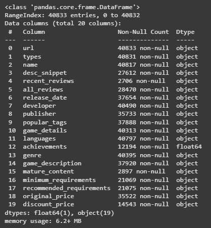
Dari gambar tersebut kita tahu bahwa dataset ini memiliki 20 kolom dengan 40833 baris. Semua kolom memiliki tipe data object kecuali achievements.

### Cek nilai kosong

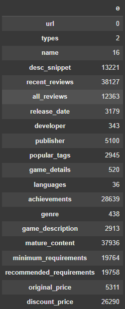
Dari gambar tersebut kita tahu bahwa data yang kita gunakan tidak bersih dari missing value, kolom paling bersih adalah kolom `url` yaitu 0 dan yang paling banyak kosongnya adalah kolom `mature_content` yaitu 37936.

### Cek nilai unik

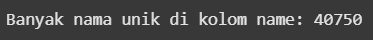
Dataset ini memilki 40750 game berbeda.
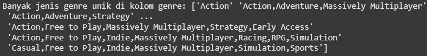
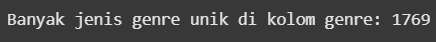
Dataset ini memiliki 1769 kombinasi genre game yang berbeda.
### Visualisasi sebaran genre

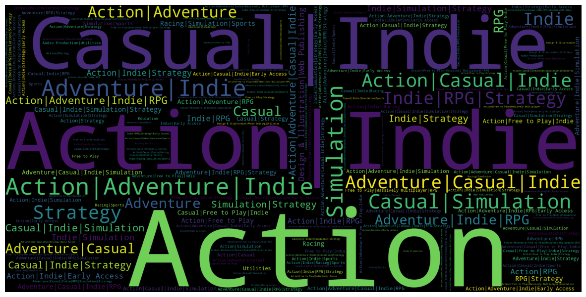
Untuk mempermudah melihat genre distribusi genre, kita menggunakan visualisasi dari `wordcloud`.

## Data Preparation

Pada bagian ini kita akan melakukan persiapan pada data agar bisa diproses model dengan optimal.

### Mengambil kolom yang sesuai
Disini kita akan mengambil kolom yang sesuai dengan tujuan kita membuat model ML, yaitu membuat rekomendasi game berdasarkan genre game yang dipilih sebelumnya.

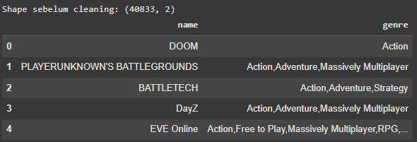
Sekarang dataset hanya punya 2 kolom yaitu `name` dan `genre` dengan baris tetap yaitu 40833 baris

### Cleaning data

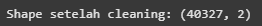
Proses selanjutnya yang kita lakukan adalah membersihkan nilai kosong pada kolom `name` dan `genre` agar tidak mengganggu model. Alasan dihapus kosong ini juga karena jumlahnya yang sangat sedikit sehingga tidak banyak menghilangkan informasi. Setelah itu kita hapus duplikasi pada kolom `name` agar tidak terjadi kebingungan karena perbedaan genre dari 2 nama yang sama saat merekomendasikan.

### Normalisasi Genre

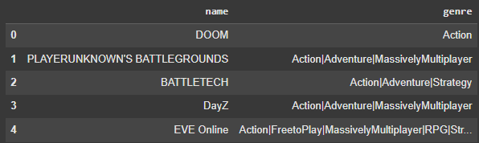
Selanjutnya adalah,
  - Mengganti pemisah koma (`,`) dengan pipe (`|`) untuk keterbacaan
  - Menghapus spasi tidak perlu untuk kejelasan bagi model
### Sampling data

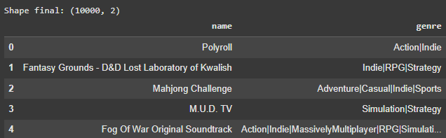
Lalu kita ambil 10000 data untuk menghemat resource. Terlebih 10000 data untuk model rekomendasi yang tidak terlalu kompleks seperti projek ini sudah sangat cukup.

Sehingga dataset kita kini memiliki 10000 baris dan 2 kolom.

### Ekstraksi fitur dengan CountVectorizer

Selanjutnya adalah kita ubah data genre menjadi vector numerik untuk pemprosesan model.
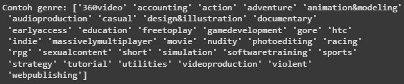

Setelahnya kita lakukan proses mapping game-to-index yaitu membuat pemetaan antara nama game dan index-nya di DataFrame `games_data` agar mudah dan cepat menemukan indeks baris (`row index`) dari game tertentu berdasarkan namanya, saat membuat sistem rekomendasi berbasis kemiripan (`similarity`).

### Validasi data

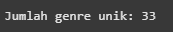
Setelah proses-proses diatas, kini dataset punya 33 genre unik tersendiri dengan genre terbanyak dipakai ditampilkan dalam grafik berikut,
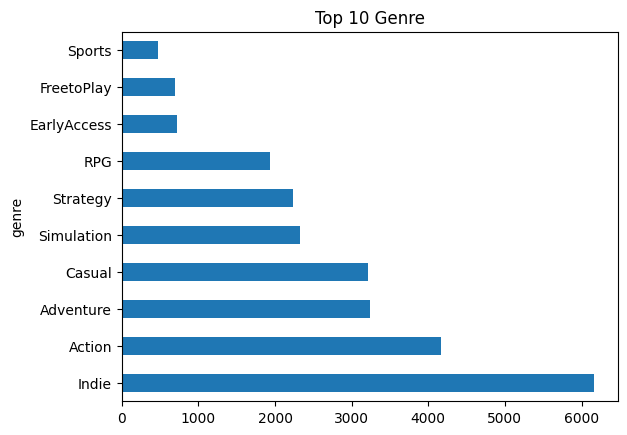

## Modeling
   🎮 Tujuan Modeling
Tahap ini bertujuan untuk membangun dua sistem rekomendasi berdasarkan genre game:
   - Content-Based Filtering – Mencari game mirip dari konten/genre.
   - Popularity-Based Recommendation – Memberi saran berdasarkan genre populer.
Setiap model akan menghasilkan output berupa Top-N Recommendation, yaitu daftar 10–20 game yang direkomendasikan.
###  Model 1 : Content-Based Filtering (Cosine Similarity on CountVectorizer) 
   🔹 Tujuan:
      Merekomendasikan game yang memiliki genre mirip dengan game yang dipilih pengguna.

   🔹 Alur kerja model:
   
      [Data Game] 
         ↓ 
      [CountVectorizer]
         ↓ 
      [Vektor Genre] 
         ↓ 
      [Cosine Similarity] 
         ↓ 
      [Matriks Similarity]
         ↓ 
      [Input Game]
         ↓ 
      [Ambil Skor Similaritas]
         ↓ 
      [Urutkan dan Filter]
         ↓ 
      [Top-N Rekomendasi]

      Jadi, sistem rekomendasi yang dibangun menggunakan pendekatan content-based ini bekerja dengan memanfaatkan data genre dari setiap game. Pertama, data game yang berisi nama dan genre diproses menggunakan `CountVectorizer`, yang berfungsi mengubah informasi genre menjadi bentuk vektor numerik. Proses ini dilakukan dengan memisahkan genre menggunakan simbol `|`, sehingga setiap game diwakili oleh vektor biner yang menunjukkan kehadiran atau ketidakhadiran suatu genre. Setelah semua game direpresentasikan dalam bentuk vektor, dihitunglah skor kesamaan antar game menggunakan **cosine similarity**, yang mengukur seberapa mirip dua vektor genre tersebut. Hasil dari proses ini adalah sebuah matriks kesamaan (similarity matrix) yang memperlihatkan tingkat kemiripan antar semua pasangan game.

      Selanjutnya, ketika pengguna memilih sebuah game sebagai input, sistem mengambil skor similarity antara game tersebut dengan semua game lainnya dari matriks tersebut. Game yang sama (input) akan dikeluarkan dari daftar, lalu sisa game diurutkan berdasarkan skor similarity tertinggi. Akhirnya, sistem menampilkan Top-N game dengan skor tertinggi sebagai rekomendasi yang paling relevan—karena secara genre, game-game tersebut dianggap paling mirip dengan game yang dipilih pengguna. Pendekatan ini sederhana namun efektif dalam menyarankan game yang relevan berdasarkan kesamaan kontennya.

Hasil dari model diatas adalah sebagai berikut:

|index|name|genre|similarity\_score|
|---|---|---|---|
|0|City Monsters|Casual&#124;Indie&#124;EarlyAccess|1\.00|
|1|Xenochamber|Casual&#124;Indie&#124;EarlyAccess|1\.00|
|2|Temple of Xiala|Casual&#124;Indie&#124;EarlyAccess|1\.00|
|3|Millionaire Dancer|Casual&#124;Indie&#124;EarlyAccess|1\.00|
|4|Tails|Casual&#124;Indie&#124;EarlyAccess|1\.00|
|5|Charpi|Casual&#124;Indie&#124;EarlyAccess|1\.00|
|6|Donut Distraction|Casual&#124;Indie&#124;EarlyAccess|1\.00|
|7|Brainstorm Party|Casual&#124;Indie&#124;EarlyAccess|1\.00|
|8|The Prison|Casual&#124;Indie&#124;EarlyAccess|1\.00|
|9|Slide Ride Arcade|Casual&#124;Indie&#124;EarlyAccess|1\.00|
|10|Trivia Night|Casual&#124;Indie&#124;EarlyAccess|1\.00|
|11|IgKnight Food Fight|Casual&#124;Indie&#124;EarlyAccess|1\.00|
|12|D\.A\.M\.A\.G\.E|Casual&#124;Indie&#124;EarlyAccess|1\.00|
|13|Tet VR|Casual&#124;Indie&#124;EarlyAccess|1\.00|
|14|Nature's Zombie Apocalypse|Action&#124;Casual&#124;Indie&#124;EarlyAccess|0\.87|
|15|Space Challenge|Action&#124;Casual&#124;Indie&#124;EarlyAccess|0\.87|
|16|Zether|Adventure&#124;Casual&#124;Indie&#124;EarlyAccess|0\.87|
|17|Call Of Unity|Action&#124;Casual&#124;Indie&#124;EarlyAccess|0\.87|
|18|MatchyGotchy Z|Casual&#124;Indie&#124;Simulation&#124;EarlyAccess|0\.87|
|19|Sumo|Action&#124;Casual&#124;Indie&#124;EarlyAccess|0\.87|

### Model 2: Popularity-Based Recommendation
   🔹 Tujuan:
   Menyarankan game berdasarkan genre yang paling sering muncul dalam dataset — cocok untuk pengguna baru.

   🔹 Alur kerja model:

      [Data Game]  
         ↓  
      [Gabungkan Semua Genre]  
         ↓  
      [Hitung Frekuensi]  
         ↓  
      [Top Genre Populer]  
         ↓  
      [Filter Game Berdasarkan Genre Populer]  
         ↓  
      [Hitung Banyaknya Genre Populer per Game]  
         ↓  
      [Urutkan & Ambil Top-N]  
         ↓  
      [Rekomendasi]

      Jadi, model kedua ini menggunakan pendekatan berbasis popularitas genre (popularity-based recommendation), yang bekerja tanpa memperhitungkan kesamaan antar game, melainkan mengandalkan informasi global tentang genre yang paling banyak muncul di seluruh dataset. Pertama-tama, seluruh genre dari semua game digabung menjadi satu string besar, kemudian dipisah berdasarkan simbol | untuk membentuk daftar semua genre yang pernah muncul. Dengan bantuan Counter, dihitunglah frekuensi kemunculan tiap genre, dan dipilih lima genre teratas yang paling sering muncul sebagai genre paling populer.

      Setelah genre-genre populer diketahui, model kemudian menyaring game-game yang mengandung setidaknya satu dari genre populer tersebut. Namun, tidak berhenti sampai di situ—setiap game kemudian dianalisis untuk melihat seberapa banyak genre populernya yang terkandung dalam game tersebut. Ini dilakukan dengan menghitung irisan antara genre game dan genre populer. Semakin banyak genre populer yang dimiliki sebuah game, semakin besar kemungkinan game itu relevan bagi banyak pengguna.

      Akhirnya, game-game tersebut diurutkan berdasarkan jumlah genre populer yang cocok (matched), dan dipilih Top-N game teratas untuk ditampilkan sebagai rekomendasi. Model ini sangat berguna untuk pengguna baru (cold start), atau ketika preferensi pengguna belum diketahui, karena menyarankan game-game yang secara umum disukai oleh banyak orang.

Hasil dari model diatas adalah sebagai berikut:

|index|name|genre|matched\_popular\_genres|
|---|---|---|---|
|1151|Myarcadegames Super Bundle|Action&#124;Adventure&#124;Casual&#124;Indie&#124;Simulation&#124;Sports&#124;Strategy&#124;Violent&#124;MassivelyMultiplayer&#124;RPG|5|
|9461|Depth Hunter 2: Treasure Hunter|Action&#124;Adventure&#124;Casual&#124;Indie&#124;Simulation&#124;Sports|5|
|1243|Mega Boogygames Bundle|Action&#124;Adventure&#124;Casual&#124;Indie&#124;Strategy&#124;Simulation&#124;Sports&#124;EarlyAccess|5|
|1280|IDALGAME Bundle COMPLETE|Action&#124;Adventure&#124;Indie&#124;MassivelyMultiplayer&#124;Simulation&#124;AudioProduction&#124;EarlyAccess&#124;Casual&#124;Education&#124;SoftwareTraining&#124;GameDevelopment|5|
|9402|Bound Up & Squirming\!|Action&#124;Adventure&#124;Casual&#124;Indie&#124;Simulation|5|
|1410|The Murder Room VR|Action&#124;Adventure&#124;Casual&#124;Indie&#124;Simulation|5|
|1430|Armored Battle Crew - Supporter Pack|Action&#124;Adventure&#124;Casual&#124;Indie&#124;Simulation&#124;Strategy|5|
|1425|Apollo4x|Action&#124;Adventure&#124;Casual&#124;Indie&#124;RPG&#124;Simulation&#124;Strategy|5|
|1471|ALL Games Narko Games|Violent&#124;Gore&#124;Action&#124;Adventure&#124;Indie&#124;Casual&#124;Racing&#124;Sports&#124;RPG&#124;Simulation&#124;Strategy&#124;EarlyAccess|5|
|1587|Naturallandscape - GuilinLandscape \(自然景观系列-桂林山水\)|Action&#124;Adventure&#124;Casual&#124;FreetoPlay&#124;Indie&#124;Racing&#124;RPG&#124;Simulation&#124;Sports|5|

## Evaluation

### 🎯 Tujuan Evaluasi
   Evaluasi dilakukan untuk mengukur relevansi hasil rekomendasi terhadap game yang dijadikan acuan. Rekomendasi yang baik adalah yang memiliki genre serupa dengan game referensi, karena dalam konteks ini, genre merupakan fitur utama dalam pemodelan.

### 📏 Metrik yang Digunakan: Precision@K
   #### ➕ Definisi:
   Precision@K mengukur proporsi item yang relevan di antara Top-K hasil rekomendasi.
   
   #### ➕ Interpretasi:
   - Nilai Precision@K = 1.00 → semua rekomendasi sangat relevan.
   - Nilai rendah → banyak rekomendasi tidak sesuai genre, perlu perbaikan.

   ### 🧪 Hasil Evaluasi

   #### 🔹 Model 1: Content-Based Filtering
   - Input game: Ninja Way
   - Output rekomendasi:
   Game-game yang direkomendasikan seluruhnya memiliki genre serupa.
   - 
   ##### Kesimpulan
   Artinya semua hasil rekomendasi cocok secara genre — model berhasil memberikan rekomendasi yang sangat relevan.

   #### 🔹 Model 2: Popularity-Based Recommendation
   - Rekomendasi didasarkan pada game dengan genre populer di dataset.
   - 
   ##### Kesimpulan
   Artinya semua hasil rekomendasi cocok secara genre — model berhasil memberikan rekomendasi yang sangat relevan.

### Kesimpulan Umum
Dalam proyek ini, telah dibangun dua sistem rekomendasi game berbasis genre menggunakan data dari platform seperti Steam, untuk menjawab permasalahan utama: overload informasi, keterbatasan data interaksi pengguna, dan kurangnya personalisasi rekomendasi.

#### 🎯 Poin-poin utama:
   1. Content-Based Filtering berhasil memberikan rekomendasi yang sangat relevan berdasarkan genre dari game referensi pengguna. Dengan Precision@10 sebesar 1.00, sistem ini menunjukkan bahwa seluruh hasil rekomendasi memiliki kemiripan fitur yang kuat.

   2. Popularity-Based Recommendation memberikan alternatif solusi yang sederhana dan efektif untuk kasus cold-start (misalnya pengguna baru yang belum memiliki preferensi). Dengan Precision@10 sebesar 1.00, sistem ini menunjukkan bahwa seluruh hasil rekomendasi memiliki kemiripan fitur yang kuat.

   3. Kedua pendekatan memberikan kontribusi yang komplementer:
   - Model content-based cocok untuk pengguna aktif dengan preferensi awal.
   - Model popularitas cocok untuk pengguna baru atau kasus minim data.

#### ✅ Implikasi Bisnis
   - Pengalaman pengguna meningkat, karena sistem mampu menyarankan game yang relevan, mengurangi kebingungan dalam memilih dari ribuan pilihan.
   - Masalah cold start teratasi, karena sistem tetap dapat memberikan rekomendasi bahkan tanpa riwayat interaksi pengguna.
   - Eksposur game meningkat, terutama bagi game yang mirip dengan game populer, memberikan nilai tambah bagi developer untuk menjangkau audiens yang sesuai.

Dengan hasil ini, sistem rekomendasi yang dikembangkan dapat menjadi fondasi awal bagi pengembangan rekomendasi hybrid yang menggabungkan konten, popularitas, dan interaksi pengguna untuk menciptakan pengalaman personal yang lebih optimal.
**---Ini adalah bagian akhir laporan---**
