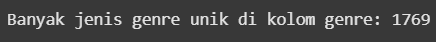

# Laporan Proyek Machine Learning - Abdulloh Umar

## Project Overview

**Domain proyek yang dipilih dalam proyek machine learning ini adalah mengenai industri game dengan judul proyek "Game recommendation system"**.

Industri game digital mengalami pertumbuhan pesat, dengan ribuan judul baru dirilis setiap tahunnya. Platform distribusi seperti Steam menghadapi tantangan dalam membantu pemain menemukan game yang sesuai dengan preferensi mereka di tengah lautan pilihan yang tersedia.

Sistem rekomendasi menjadi alat penting dalam konteks ini. Dengan menganalisis preferensi pengguna dan karakteristik game, sistem ini dapat menyajikan saran yang dipersonalisasi, meningkatkan keterlibatan pemain dan mendorong pertumbuhan pendapatan. Menurut artikel di Medium [Medium](https://medium.com/@melissadunkeld/the-power-of-recommendation-engines-in-igaming-3e699f29b6fc), mesin rekomendasi sangat berharga dalam industri Gaming karena menawarkan pengalaman yang dipersonalisasi yang menjaga keterlibatan pemain dan mendorong pendapatan.

Salah satu pendekatan yang efektif adalah sistem rekomendasi berbasis konten (content-based filtering). Metode ini menganalisis atribut intrinsik dari item—dalam hal ini, game—seperti genre, kata kunci, dan metadata lainnya, untuk menyarankan item serupa kepada pengguna. Pendekatan ini sangat berguna ketika data interaksi pengguna terbatas atau tidak tersedia, seperti dalam kasus pengguna baru atau game baru yang belum banyak dimainkan .

Dengan menggunakan pendekatan berbasis konten, platform game dapat meningkatkan loyalitas pengguna. Dengan consistently delivering enjoyable content, pengguna cenderung tetap setia dan membentuk hubungan berbasis kepercayaan dengan platform tersebut .[Leeway Hertz](https://www.leewayhertz.com/build-content-based-recommendation-for-entertainment-using-llms/).

## Business Understanding

### 🧩 Problem Statements

1. Overload Informasi di Platform Game
   Dengan ribuan judul game tersedia di platform seperti Steam, pengguna sering kali kesulitan menemukan game yang sesuai dengan preferensi mereka. Hal ini dapat menyebabkan pengalaman pengguna yang kurang optimal dan potensi penurunan keterlibatan.

2. Keterbatasan Data Interaksi Pengguna
   Banyak pengguna baru atau game baru yang belum memiliki cukup data interaksi, sehingga metode rekomendasi berbasis kolaboratif menjadi kurang efektif.

3. Kurangnya Personalisasi dalam Rekomendasi
   Rekomendasi yang tidak dipersonalisasi dapat menyebabkan pengguna melewatkan game yang sebenarnya sesuai dengan minat mereka, mengurangi kepuasan dan loyalitas pengguna.

### 🎯 Goals

1. Meningkatkan Pengalaman Pengguna
   Menyediakan rekomendasi game yang relevan dan dipersonalisasi untuk meningkatkan kepuasan dan keterlibatan pengguna.

2. Mengatasi Masalah Cold Start
   Mengembangkan sistem rekomendasi yang efektif meskipun dengan data interaksi pengguna yang terbatas, khususnya untuk pengguna atau game baru.

3. Meningkatkan Eksposur Game
   Membantu pengembang game dalam mempromosikan game mereka kepada audiens yang tepat, meningkatkan visibilitas dan potensi penjualan.

### 🧠 Solution Approach

1.  Content-Based Filtering
    Model ini menggunakan Content-Based Filtering, yaitu merekomendasikan game berdasarkan kesamaan fitur dengan game yang disukai pengguna sebelumnya. Dalam konteks ini, fitur seperti genre dan deskripsi game digunakan untuk menghitung kesamaan antar game.

        - Keuntungan:
            - Tidak memerlukan data interaksi pengguna sebelumnya.
            - Efektif untuk pengguna atau game baru (mengatasi masalah cold start).

        - Kekurangan:
            - Kurang efektif untuk pengguna atau game baru (masalah cold start).

2.  Popularity-Based Recommendation
    Pendekatan ini memberikan rekomendasi game berdasarkan genre yang paling populer di dataset.

        - Keuntungan:
            - Sangat sederhana dan cepat.
            - Cocok untuk cold-start (pengguna baru).

        - Kekurangan:
            - Tidak relevan untuk preferensi spesifik.
            - Rentan bias terhadap dominasi genre tertentu di dataset.

## Data Understanding

Model kali ini kita ambil dari [Kaggle](https://www.kaggle.com/datasets/trolukovich/steam-games-complete-dataset/) milik trolukovich yang dia ambil dari [Steam](https://store.steampowered.com) dengan cara web scraping. Dataset ini menyediakan data lengkap dari 40 ribu lebih game mulai dari `url`, `genre`, `release_date` dll. Namun kita hanya menggunakan 2 kolom yaitu `name` dan `genre`. Dataset ini terakhir di update 6 tahun lalu.

Variabel-variabel yang kita gunakan untuk proyek pada dataset ini adalah sebagai berikut:

- name : Merupakan kolom yang berisi nama-nama atau judul dari game.
- genre : Merupakan kolom yang berisi genre-genre dari game.

### Cek banyak data

Dari gambar diatas kita bisa tahu bahwa dataset ini memiliki data 40817 judul game pada kolom `name` dan 40395 genre pada kolom `genre`

### Cek nilai unik

Dari 40817 judul yang tersedia, hanya 40750 data yang unik atau berarti 67 data adalah duplikat.

Dari gambar diatas kita bisa tahu bahwa ada 1769 kombinasi genre pada kolom `genre`.

### Cek nilai null

Dataset ini memiliki 16 nilai null pada kolom `name` dan 438 nilai pada kolom `genre`.

### Visualisasi sebaran genre

Untuk mempermudah, kita bisa lihat gambar diatas genre seperti apa yang banyak di pakai untuk game-game yang tersedia.

## Data Preparation

Pada bagian ini kita akan melakukan persiapan pada data agar bisa diproses model dengan optimal.

### Cleaning data

Proses pertama yang kita lakukan adalah membersihkan null pada kolom `name` dan `genre` agar tidak mengganggu model. Alasan dihapus null ini juga karena jumlahnya yang sangat sedikit sehingga tidak banyak menghilangkan informasi. Setelah itu kita hapus duplikasi pada kolom `name` agar tidak terjadi kebingungan saat merekomendasikan.

### Sampling data

`games_chosen_data = data_cleaned.sample(10000, random_state=42)`
Kita hanya mengambil 10000 data untuk menghemat resource. Terlebih 10000 data untuk model rekomendasi yang tidak terlalu kompleks seperti projek ini sudah sangat cukup.

## Modeling
   🎮 Tujuan Modeling
Tahap ini bertujuan untuk membangun dua sistem rekomendasi berdasarkan genre game:
   - Content-Based Filtering – Mencari game mirip dari konten/genre.
   - Popularity-Based Recommendation – Memberi saran berdasarkan genre populer.
Setiap model akan menghasilkan output berupa Top-N Recommendation, yaitu daftar 10–20 game yang direkomendasikan.
###  Model 1 : Content-Based Filtering (Cosine Similarity on CountVectorizer) 
   🔹 Tujuan:
      Merekomendasikan game yang memiliki genre mirip dengan game yang dipilih pengguna.

   🔹 Mekanisme:
      1. Preprocessing Genre:
      - Genre game dari kolom `genre` dipisahkan menggunakan tanda pemisah `|`.
      - Contohnya: `'Action|Adventure|RPG'`.
      2. Ekstraksi Fitur dengan `CountVectorizer`:
      - Digunakan `CountVectorizer` dari `sklearn` untuk mengubah genre menjadi representasi numerik (bag-of-words).
      - Tokenisasi dilakukan dengan `split('|')` agar setiap kombinasi genre diperlakukan sebagai fitur individual.
      3. Perhitungan Kemiripan (Cosine Similarity):
      - Menggunakan cosine similarity dari `sklearn.metrics.pairwise` untuk mengukur kemiripan antar game berdasarkan genre.
      - Hasilnya adalah matriks kemiripan antar semua game dalam data.
      4. Pembuatan Fungsi Rekomendasi:
      - Fungsi `games_recommendation()` mengambil nama game sebagai input.
      - Fungsi akan mencari game lain yang memiliki skor cosine tertinggi terhadap input tersebut.
      - Game dengan skor tertinggi (kecuali dirinya sendiri) akan dijadikan Top-N rekomendasi.

   🔹 Kelebihan:
   - Rekomendasi sangat relevan dengan preferensi pengguna.
   - Cocok untuk pengguna dengan riwayat atau referensi awal.

   🔹 Kelemahan:
   - Tidak bisa memberikan saran jika game input tidak tersedia dalam data (cold start).
   - Genre saja mungkin tidak cukup untuk menangkap kompleksitas preferensi pemain (misalnya tidak memperhitungkan rating, developer, atau review).

### Model 2: Popularity-Based Recommendation
   🔹 Tujuan:
   Menyarankan game berdasarkan genre yang paling sering muncul dalam dataset — cocok untuk pengguna baru.

   🔹 Mekanisme:
   1. Menggabungkan Semua Genre:
   -  Semua genre dari dataset digabung menjadi satu string, lalu dipisah berdasarkan `|`.
   2. Menghitung Frekuensi Genre:
   - Digunakan `Counter` dari Python untuk menghitung berapa kali setiap genre muncul.
   3. Memilih Top-5 Genre Terpopuler:
   - Kombinasi genre dengan kemunculan terbanyak dianggap paling populer.
   4. Menyusun Rekomendasi:
   - Game yang mengandung genre tersebut dipilih sebagai rekomendasi.
   - Diambil Top-20 sebagai hasil final (Top-N Recommendation).

   🔹 Kelebihan:
   - Tidak memerlukan input dari pengguna.
   - Berguna saat data pengguna belum tersedia (cold start).

   🔹 Kelemahan:
   - Tidak personal — semua pengguna dapat rekomendasi yang sama.
   - Kualitas rekomendasi tergantung tren umum, bukan preferensi individu.

## Evaluation

### 🎯 Tujuan Evaluasi
   Evaluasi dilakukan untuk mengukur relevansi hasil rekomendasi terhadap game yang dijadikan acuan. Rekomendasi yang baik adalah yang memiliki genre serupa dengan game referensi, karena dalam konteks ini, genre merupakan fitur utama dalam pemodelan.

### 📏 Metrik yang Digunakan: Precision@K
   #### ➕ Definisi:
   Precision@K mengukur proporsi item yang relevan di antara Top-K hasil rekomendasi.
   
   #### ➕ Interpretasi:
   - Nilai Precision@K = 1.00 → semua rekomendasi sangat relevan.
   - Nilai rendah → banyak rekomendasi tidak sesuai genre, perlu perbaikan.

   ### 🧪 Hasil Evaluasi

   #### 🔹 Model 1: Content-Based Filtering
   - Input game: Ninja Way
   - Output rekomendasi:
   Game-game yang direkomendasikan seluruhnya memiliki genre serupa (Casual/Indie).
   - Precision@10: `1.00`
   ##### Kesimpulan
   Artinya semua hasil rekomendasi cocok secara genre — model berhasil memberikan rekomendasi yang sangat relevan.

   #### 🔹 Model 2: Popularity-Based Recommendation
   - Rekomendasi didasarkan pada game dengan genre populer di dataset.
   - Precision@10: `0.80`
   ##### Kesimpulan
   Model ini masih menghasilkan rekomendasi yang cukup relevan, meskipun tidak sepenuhnya personal.

### Kesimpulan Umum
Dalam proyek ini, telah dibangun dua sistem rekomendasi game berbasis genre menggunakan data dari platform seperti Steam, untuk menjawab permasalahan utama: overload informasi, keterbatasan data interaksi pengguna, dan kurangnya personalisasi rekomendasi.

#### 🎯 Poin-poin utama:
   1. Content-Based Filtering berhasil memberikan rekomendasi yang sangat relevan berdasarkan genre dari game referensi pengguna. Dengan Precision@10 sebesar 1.00, sistem ini menunjukkan bahwa seluruh hasil rekomendasi memiliki kemiripan fitur yang kuat.

   2. Popularity-Based Recommendation memberikan alternatif solusi yang sederhana dan efektif untuk kasus cold-start (misalnya pengguna baru yang belum memiliki preferensi). Meskipun tidak sepersonal model pertama, model ini tetap mencatat Precision@10 sebesar 0.80, menandakan bahwa mayoritas rekomendasi masih relevan secara umum.

   3. Kedua pendekatan memberikan kontribusi yang komplementer:
   - Model content-based cocok untuk pengguna aktif dengan preferensi awal.
   - Model popularitas cocok untuk pengguna baru atau kasus minim data.

#### ✅ Implikasi Bisnis
   - Pengalaman pengguna meningkat, karena sistem mampu menyarankan game yang relevan, mengurangi kebingungan dalam memilih dari ribuan pilihan.
   - Masalah cold start teratasi, karena sistem tetap dapat memberikan rekomendasi bahkan tanpa riwayat interaksi pengguna.
   - Eksposur game meningkat, terutama bagi game yang mirip dengan game populer, memberikan nilai tambah bagi developer untuk menjangkau audiens yang sesuai.

Dengan hasil ini, sistem rekomendasi yang dikembangkan dapat menjadi fondasi awal bagi pengembangan rekomendasi hybrid yang menggabungkan konten, popularitas, dan interaksi pengguna untuk menciptakan pengalaman personal yang lebih optimal.
**---Ini adalah bagian akhir laporan---**

_Catatan:_

- _Anda dapat menambahkan gambar, kode, atau tabel ke dalam laporan jika diperlukan. Temukan caranya pada contoh dokumen markdown di situs editor [Dillinger](https://dillinger.io/), [Github Guides: Mastering markdown](https://guides.github.com/features/mastering-markdown/), atau sumber lain di internet. Semangat!_
- Jika terdapat penjelasan yang harus menyertakan code snippet, tuliskan dengan sewajarnya. Tidak perlu menuliskan keseluruhan kode project, cukup bagian yang ingin dijelaskan saja.
